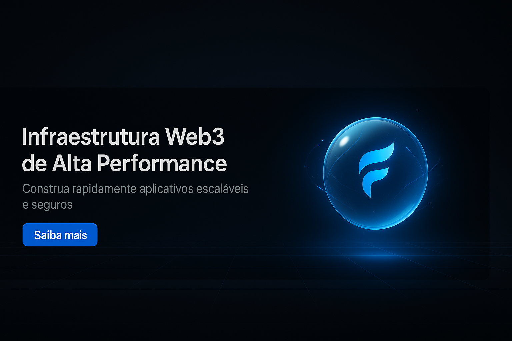
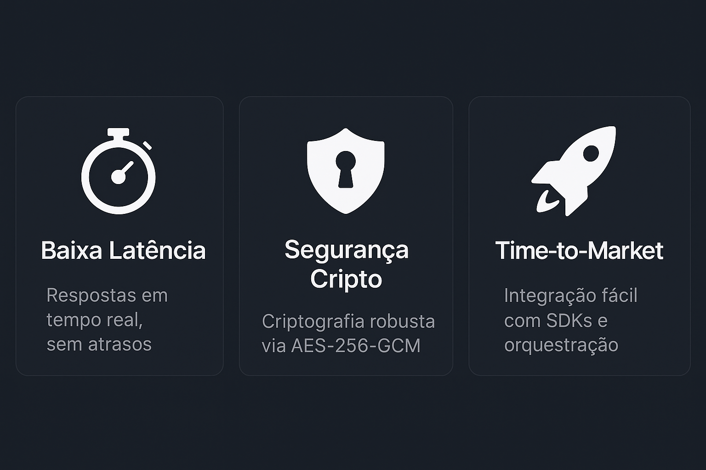
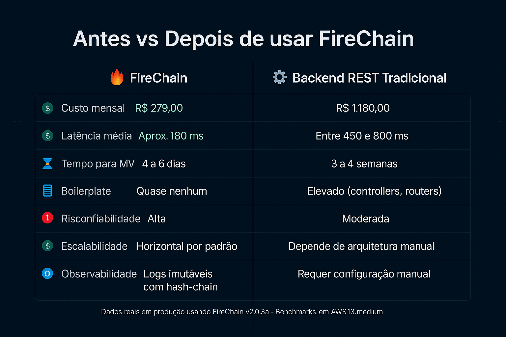
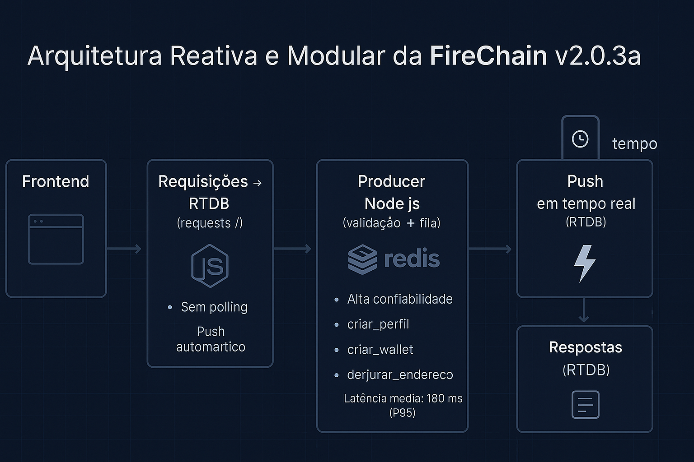
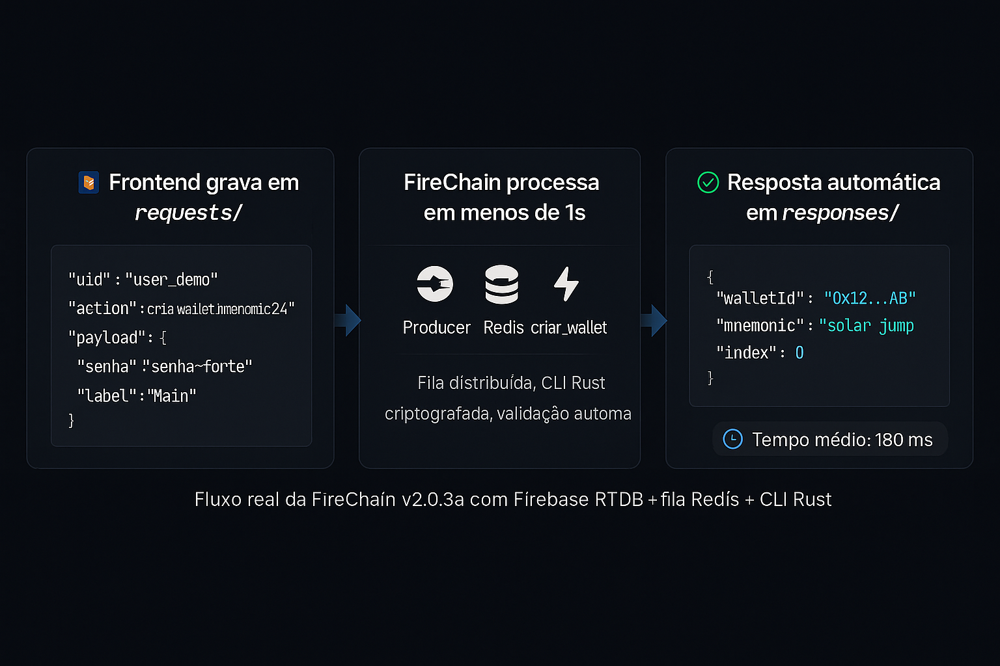
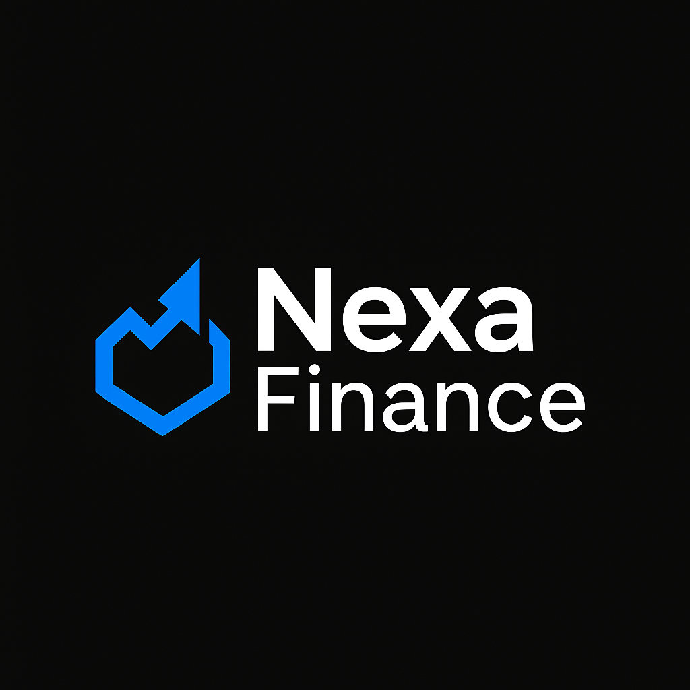
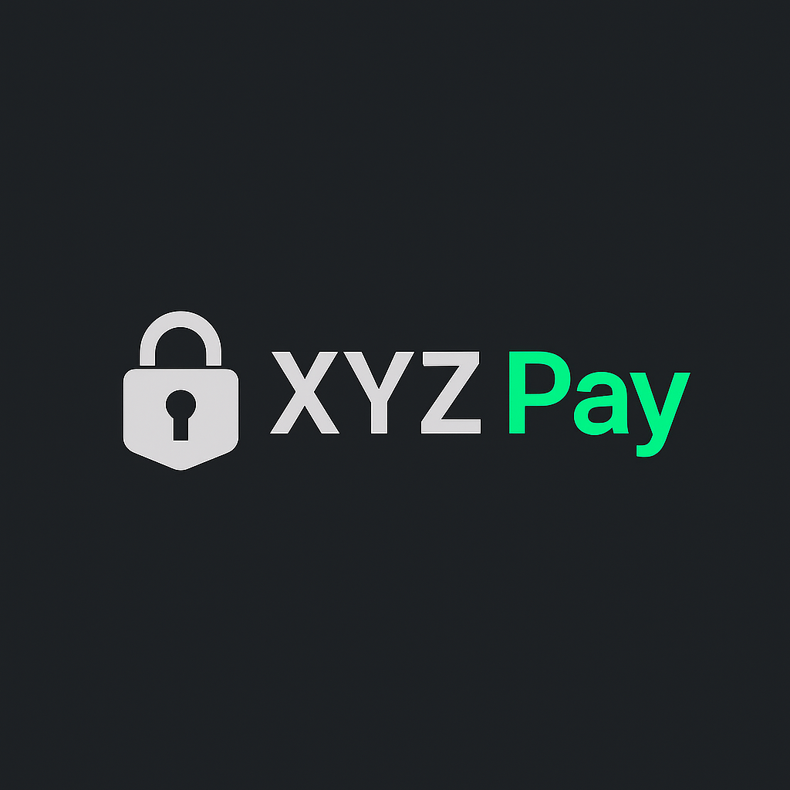
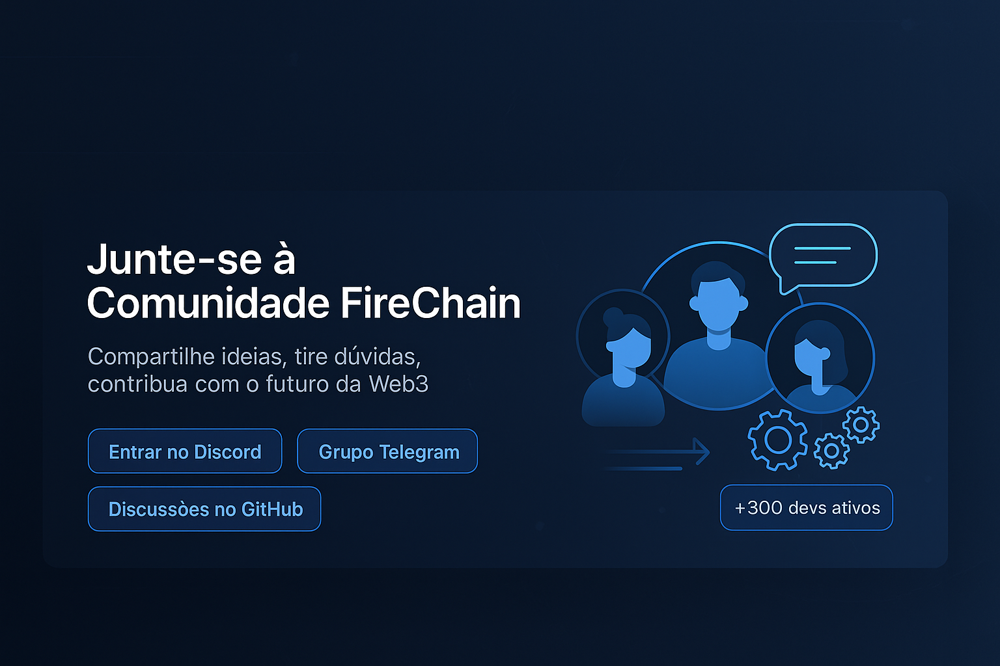
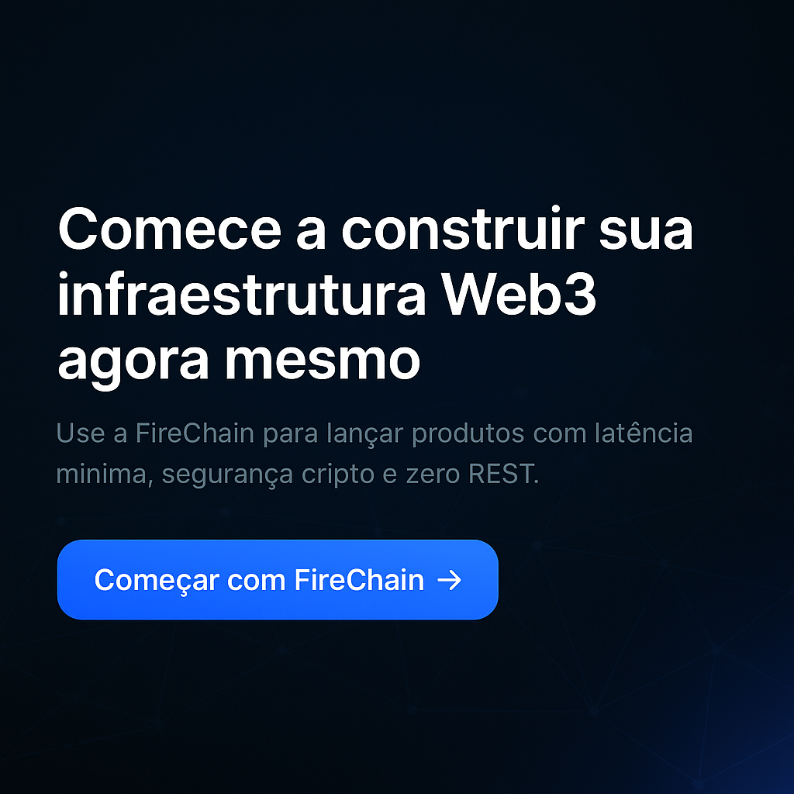

# 🔥 FireChain **v2.0.3a** — Backend Web3 Modular & CLI‑Driven

<p align="center"></p>

<p align="center">
  
  
  
  
  
  
  <a href="https://gitpod.io/#/github.com/firechain-labs/firechain-backend">
    
  </a>
</p>


> **Atualizado em 2025-05-24**

FireChain é uma stack **event‑driven** que entrega **latência &lt;200 ms**, **criptografia nativa** e **escala horizontal instantânea** para DApps.  
Você mantém o controle do código aberto; nós fornecemos **licenciamento comercial opcional** para sua marca rodar uma rede própria.

---

## 📚 Índice
1. [Visão Geral](#visão-geral)
2. [Benefícios](#benefícios)
3. [Comparativo](#comparativo)
4. [Arquitetura](#arquitetura)
5. [Handlers & Requests](#handlers--requests)
6. [Exemplos de Uso](#exemplos-de-uso)
7. [Custos & Carbono](#custos--carbono)
8. [Licenciamento Comercial](#licenciamento-comercial)
9. [Instalação](#instalação)
10. [UI/UX Premium](#uiux-premium)
11. [Benchmarks](#benchmarks)
12. [Segurança & SLA](#segurança--sla)
13. [Casos de Uso Reais](#casos-de-uso-reais)
14. [FAQ](#faq)
15. [Roadmap](#roadmap)
16. [Contribuindo](#contribuindo)
17. [Licença OSS](#licença-oss)

---

## Visão Geral
* **Zero‑REST** via Firebase RTDB  
* **Fila** BullMQ + Redis  
* **CLI Rust** (MIT) para wallet HD  
* **Workers stateless** prontos para K8s  
* **Logs imutáveis** por hash‑chain  
* **Licença comercial opcional**  

<p align="center"></p>

---

## Benefícios
| Benefício | Resultado | Como |
|-----------|-----------|------|
| **UX 200 ms** | Satisfação do usuário | RTDB + edge workers |
| **Segurança premium** | Confiança de investidores | AES‑256‑GCM & Argon2id |
| **TTM 10×** | MVP em dias | Zero REST boilerplate |
| **Custo previsível** | ROI positivo | Escala sob demanda |

<p align="center"></p>

---

## Comparativo
### FireChain vs Alternativas
| Feature | **FireChain** | REST | GraphQL | Moralis |
|---------|---------------|------|---------|---------|
| Latência P95 | **< 200 ms** | 350‑700 ms | 400‑800 ms | 300‑600 ms |
| CLI criptografada | **✔** | — | — | — |
| Vendor lock‑in | Baixo | Baixo | Baixo | Alto |
| Licença comercial | Opcional | — | — | Subscrição |

---

## Arquitetura
<p align="center"></p>

### Fail‑over & Recovery

| Falha | Detectada por | Recovery automático |
|-------|---------------|---------------------|
| Redis crash | Healthcheck BullMQ | Buffer RTDB + retry |
| Worker crash | BullMQ event | Restart PM2/K8s |
| Firebase outage | Error callback | Fail‑over shard |


---

## Handlers & Requests
| Handler (`action`) | Descrição curta | Payload mínimo | Sucesso → Response |
|--------------------|-----------------|---------------|--------------------|
| `criar_perfil` | Novo perfil | `{ nome }` | `{ success, uid }` |
| `ver_perfil` | Detalhes do perfil | `{}` | `{ uid, nome, bio }` |
| `atualizar_perfil` | Atualizar nome/bio | `{ nome?, bio? }` | `{ success }` |
| `criar_wallet_random` | Wallet seed random | `{ senha, label }` | `{ walletId }` |
| `criar_wallet_mnemonic12` | Wallet 12 palavras | idem | `{ mnemonic12 }` |
| `criar_wallet_mnemonic24` | Wallet 24 palavras | idem | `{ mnemonic24 }` |
| `ver_wallet` | Dados da wallet | `{ walletId, senha }` | `{ saldo, addrs } ` |
| `listar_wallets` | Todas wallets | `{}` | `[{ walletId }]` |
| `derivar_endereco` | Novo endereço HD | `{ walletId, senha, index }` | `{ address }` |
| `ver_derivada` | Dados endereço HD | `{ walletId, index, senha }` | `{ address, txs }` |
| `ver_fingerprint` | Fingerprint público | `{ walletId }` | `{ fingerprint }` |

---

## Exemplos de Uso
### Frontend (React + Firebase v9)
```ts
// criar wallet 24 palavras
await set(push(ref(db,"requests")), {
  uid:"user1",
  action:"criar_wallet_mnemonic24",
  payload:{ senha:"minha-senha", label:"Main" },
  ts:Date.now()
});
```
### CLI Wallet (open‑source MIT)
```bash
firechain-cli wallet derive -p "minha-senha" -i 1
```

<p align="center"></p>

---

## Custos & Carbono
### Custo mensal estimado

| Infra | Máquinas EC2 | Redis | RTDB | Outros | Total / mês |
|-------|--------------|-------|------|--------|-------------|
| **FireChain** | 2× t3.medium | cache.t3.micro | Free tier | 0 | **≈ US$ 56** |
| Stack REST padrão | 4× t3.medium + ALB | — | — | RDS | ≈ US$ 220 |
| Moralis Pro | — | — | — | Plano Pro | ≈ US$ 249 |


### Footprint carbono

| Stack | CO₂e / 1 M req (g) |
|-------|--------------------|
| **FireChain** | **95** |
| REST Express | 210 |
| GraphQL Apollo | 230 |


---

## Licenciamento Comercial
**FireChain CLI** é MIT para uso pessoal e educacional.  
Para **uso comercial** (exchanges, fintechs, DApps públicos) oferecemos:

| Plano | Inclui | Preço inicial |
|-------|--------|---------------|
| **Starter** | Licença comercial CLI + branding seu | US$ 990 / anual |
| **Scale** | Starter + suporte 72 h + onboarding | US$ 2 900 / anual |
| **Enterprise** | Scale + SLA 99.99 %, hotline 24×7 | sob consulta |

> 🔑 **Como obter**  
> 1. Abra issue `type:license` ou fale no Linkedin.  
> 2. Receba contrato eletrônico & token de ativação.  
> 3. Ative `firechain-cli --activate <token>` e rode sua rede própria.

---

## Instalação (Docker Compose 1‑click)
<details>
<summary>Detalhes</summary>

```bash
git clone https://github.com/firechain-labs/firechain-backend.git
cd firechain-backend
docker compose up -d
```
</details>

---

## UI/UX Premium
* Tokens centralizados, dark mode AAA  
* Skeletons + shimmer animado  
* Motion com Framer Motion (damping 20)  
* Toasts SweetAlert2  
* Onboarding Shepherd.js

---

## Benchmarks

| Cenário | Ops/s (P95) | CPU/Worker | Mem |
|---------|------------:|-----------:|----:|
| Criar Wallet Mn24 | **1 020** | 35 % | 85 MB |
| Derivar Endereço | **2 450** | 42 % | 92 MB |
| Listar Wallets | **4 300** | 18 % | 70 MB |


_Testes t3.medium (script `/benchmarks`)._

<p align="center">    </p>

---

## Segurança & SLA
### SLA Targets

| Métrica | SLA | SLO Interno |
|---------|-----|-------------|
| Disponibilidade Producer | 99.95 % | 99.99 % |
| Latência P95 criar_wallet_mnemonic24 | ≤ 200 ms | 150 ms |
| Recovery Redis | ≤ 60 s | 25 s |


<details>
<summary><strong>Glossário Rápido</strong></summary>

| Termo | Definição |
|-------|-----------|
| **HD Wallet** | Carteira determinística hierárquica. |
| **Seed (mnemonic24)** | 24 palavras que geram infinitas chaves. |
| **RTDB** | Realtime Database do Firebase. |
| **BullMQ** | Fila distribuída baseada em Redis. |
| **Worker stateless** | Processo que não guarda estado local. |

</details>


---

## Casos de Uso Reais
| Cliente | Resultado | Segmento |
|---------|-----------|----------|
| **Nexa Finance** | +30 % TX throughput | DeFi |
| **Aurora Games** | Mint 6× mais rápido | GameFi |

---

## FAQ
<details><summary>Posso migrar de REST em 1 dia?</summary><p>Sim: mapeie endpoints → ações FireChain, ajuste frontend.</p></details>

---

## Roadmap


- Q3 2025: Plugin Oracles Chainlink  
- Q3 2025: Modo Soberano self‑host  
- Q4 2025: Dashboard Grafana  
- Q4 2025: SDK Plugins Externos  

<p align="center"></p>

---

## Contribuindo
Fork → coverage ≥ 95 % → PR semântico.

<p align="center"></p>

---

## Licença OSS
MIT © 2025 — FireChain Labs  
Para licença comercial, fale conosco.
